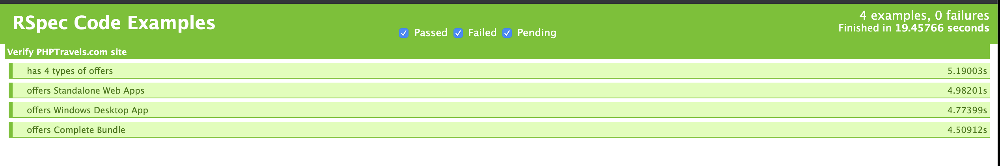

# Make Testing Great Again: Powerful UI tests with Ruby, Rspec, Rake and Webdriver

#### With :heart: by [Frederik Rodriguez](https://github.com/frederikrodriguezGL)


## Introduction
Though most of newest FrontEnd Development projects have moved to Javascript Frameworks, leaving Fullstack frameworks (e.g JSP, ASP.Net and Ruby on Rails) in the water, still there are dozens of projects and customers out there with Rails projects; and even some of them have migrated their stacks to have API's based on Rails, and FrontEnd in React, Angular or whatever poison they want to drink. 

Here is the sweetspot where we want to work with. These projects have a strong investment in Ruby code, seasoned developers polished in the arts of Ruby and Testing based on that. Currently is extremely hard to find available Automators with Ruby expertise and here is where this article fits in, Today we will teach you the arts of creating a Testing Project using the Ruby language and the available tools. 

This will be our agenda for this article
- Tools Installation and what do they do
- Creating the first tests, start from the ground, and go up
- Improving code with the **Page Object Model** Pattern, 
- Executing tests with **RSpec** and **Rake**, 
- Keeping all dependencies in check with **Bundler**
- **WebDrivers** and the tools in **Ruby** for it
- and so on


## The basics:

### Ruby
Ruby is an **interpreted**, **multipurpose**, **multiparadigm**, **Object-Based**, **Hardtyped** programming language, that receives a lot of praise for the simplicity of their syntax and the powerful Rails framework

Install Ruby is not hard, actually comes preinstalled in most MacOS X distributions, just in case you want to have the latest version use `RVM`

Open [rvm.io](https://rvm.io/) and follow the instructions to install the manager

Once installed, just open a terminal and run 
```bash
$ rvm install ruby
$ rvm --default use ruby
```

If you use Windows, please install [Ruby for Windows](https://rubyinstaller.org/)

### Ruby-Gems
Most of the libraries available in Ruby are packaged as gems, a gem is a library that offers a certain functionality, and you can download it and use it. This concept is similar to `NPM` if you come from the Javascript world.

So, lets install our first gem

```bash
$ gem install bundler
```

### Bundler
**Bundler** is a powerful dependencies manager for Ruby, Similar to `NPM` or `Maven` or `NuGet`

Let's open our project directory and create our Gemfile, this file will allow us to have our list of gems to install, and simplify for future developers to have the environment ready in less time.

```bash
$ mkdir Rubytests && cd Rubytests
$ touch Gemfile
```

Edit the Gemfile and add this lines:


```Gemfile
source 'https://rubygems.org'
gem 'selenium-webdriver'
```
`source 'https://rubygems.org'` establishes which Gem repository are we going to use, in this case, we will go with the public repository

`gem 'selenium-webdriver'` is the first gem we need, let's talk about it next: 
### Webdriver
`Webdriver` is a framework that allows to simulate human interaction with a browser, using a couple of lines of code, you can open a webpage, write a query and hit the search button.

Webdriver is mature, has evolved well with time, and it has support for a **dozen of different programming languages** and all of the **major browsers** out there, of course, Ruby is included.

After we have the Gemfile updated, we run the following command:

```bash
bundle install
```

With this, Bundler should have included all gems required.

### ChromeDriver
ChromeDriver is the official plugin support for the Chrome browser, install it and we can control Chrome

add this line to your Gemfile

```gemfile
gem 'chromedriver-helper'
```

and execute again:

```bash
bundle install
```


## Let's get our hands dirty

### The first test:
Creating a test that verify a web page is as simple as this:

```ruby
# The libraries we need, for the tests we build.
require "selenium-webdriver"
require "chromedriver-helper"

# Lets open a Chrome Driver
driver = Selenium::WebDriver.for :chrome

# Navigate.to indicates Chrome which webpage to open
driver.navigate.to "https://formy-project.herokuapp.com/form"

# find_element allows to interact with an element based on its ID, CSS selector or Xpath
driver.find_element(id: 'first-name').send_keys('John')

# send_keys allows to fill a form field
driver.find_element(id: 'last-name').send_keys('Doe')

# click allows to hit the button
driver.find_element(css: '.btn.btn-lg.btn-primary').click()
banner = driver.find_element(class: 'alert')

#Always close the browser when your tests are over
driver.quit
```


### Page Object Model
Though this test is perfectly functional, there are several things that pop up to eye of the seasoned developer:

- What if we need to make more similar tests?, Like testing every single field for negative results.
- What if the locators change and you have dozens of tests in different files?
- Having implementation details in test files usually is a bad code smell.
- There are lots of code that can be reused instead of repeated.
- There are functions that can be placed in a base class and reuse all the way around.

Here is where we will start improving our code.

The Page Object Model is a powerful pattern that allows to centralize business logic in classes that are specialized for a certain part of the Application under test, then allows to use that business logic in different tests, this way we can improve how many tests do we write, we mask the access to webdriver functionality, reduce the costs included with rewriting accessors and build smaller, more maintainable functions that are simpler to understand and modify

Lets begin with a base page, and check a powerful concept in Ruby, Inheritance:

#### Inheritance in OOP
The basic idea behind Object Oriented languages is to centralize business logic in classes that represent real life elements (Like an employee, a car or a Webpage). In Ruby we can apply this concept in a simple manner:

In our project directory, let's create a folder for our pages, remember, a well organized code is a happy code

```bash
$ mkdir pages && cd pages
$ touch TravelsBasePage.rb
```
and put the following code inside:

```ruby
# Base page
require 'selenium-webdriver'


class TravelsBasePage #::Class:: is the  keyword 
 
 def initialize(driver) # Initialize is the method invoked by Ruby when a new class is invoked
    @driver = driver # Lets share the same driver always

    # Set configurations for driver, global for all objects that use this driver
    @driver.manage.timeouts.implicit_wait = 10 # Implicit wait
    @driver.manage.window.maximize # We want to have our Browser full screen all time.
  end

  def getDriver # Accessor methods
    @driver 
  end

  def finalizeDriver # Utility to close the driver
    @driver.quit
  end
end

```

This first page does not do a lot, yet gives us a glimpse of the power of classes,

#### Implicit Wait
` @driver.manage.timeouts.implicit_wait = 10` 

Here we have a powerful concept of Webdriver, Implicit wait. UI tests usually execute at a blazing pace, and it is common to have failing tests because the **webdriver works faster than the application under test.** Implicit wait orders the webdriver to continuously verify if an element is available and **fail only if more than certain amount of time has passed** (10 minutes in this case)

Implicit wait allows to have cleaner code and sturdier tests that do not fail as often for delays in the application under test.

### Let's Inherit our base class
We will use our base class as the starting point for other classes, which would give us more condensed business logic

But first let's see our Application Under test:


At first sight we can see certain logic we can use:

- We want to see which plans are available
- We would like to verify if an specific plan can be bought at every time
- We may want to count how many plans are always available, in case we have a moving offer of plans, so lets begin with that:

Let's go back to the root of our project folder and execute the upcoming commands

```bash
$ touch pages/OrdersPage.rb
```
And put inside the following code

 
```ruby
require 'selenium-webdriver'
require_relative 'TravelsBasePage'

class OrdersPage < TravelsBasePage # The < symbol expresses inheritance
  def initialize(driver) # Let's initialize our class with the required elements
    @url = 'https://phptravels.com/order/' #This is our initial URL, our AUT
    
    super(driver) # With super we can access the constructor of our parent class
    @driver.navigate.to @url
    @logger.info("Created #{self.class.name}") # We will talk abour our logger later
  end
end
```

We will start our class with the basics, one initializer that will call the parent object and will send a shared Webdriver for it.

Our class has straight access to our application under test, and it will navigate to it when it starts.

Let's add the first business logic method, look for all of the offers:

```ruby
require 'selenium-webdriver'
require_relative 'TravelsBasePage'

class OrdersPage < TravelsBasePage # The < symbol expresses inheritance
  def initialize(driver) # Let's initialize our class with the required elements
    @url = 'https://phptravels.com/order/' 
    @offersSelector = '.tab-content .col-md-3' # the locator for our offers
    super(driver) 
    @driver.navigate.to @url
    @logger.info("Created #{self.class.name}") 
  end

#::: NEW CODE :::
#The list of offers is offered as an array of Elements
   def listOfOffers 
    offers = @driver.find_elements(css: @offersSelector) # we tell our Webdriver to give us the list of offers using find_elements
    @logger.warn("There are #{offers.count} offers" )
    offers
  end

# We will use the method given before to count the amount of offers
  def getAmountOfOffers
    $offers = listOfOffers() # Look Ma, code reuse
    $offers.count()
  end
end
  
```

### Here comes the logger
We can add logging functionalities to our tests using the simple logger gem

In our `TravelsBasePage.rb` we add the following code

```ruby
require 'selenium-webdriver'
require 'logger' # import the logger gem

class TravelsBasePage
  def initialize(driver)
    @driver = driver
    @logger = Logger.new(STDOUT) # Basic logger, with output to the console, this logger will be used for all classes that inherit our base class
    @driver.manage.timeouts.implicit_wait = 10 # seconds
    @driver.manage.window.maximize
  end

  def getDriver
    @driver
  end

  def finalizeDriver
    @driver.quit
  end
end
```

Now let's create a test that will use our `OrdersPage`.

Go to the root of our project, and execute the following commands:
```bash
$ mkdir tests -p tests/UI @@ cd tests/UI
$ touch PHPTRAVELS_orders_test.rb 
```
Remember, a clean code, is a happy code

### Rspec
Rspec is a test execution framework for Ruby, pretty similar to JUnit or Jasmine. It is simple to use, I will show you how it works:

First of all, let's add the gem we need, open the `Gemfile` and add:
```Gemfile
source 'https://rubygems.org'
gem 'selenium-webdriver'
gem 'chromedriver-helper'
gem 'rspec' # Lets add the dependency
```

execute `$ bundle install` in a console and the dependency is added to our repo

In our `PHPTRAVELS_orders_test.rb ` add the following code

```ruby

require 'selenium-webdriver'
require 'rspec'
require 'chromedriver-helper'
require_relative '../../pages/OrdersPage' #Import our PageObject

describe 'Verify PHPTravels.com site' do # All tests begin with describe
  
  # Before and After filters execute code that needs to be ran before every test.
  before(:each) do
    @driver = Selenium::WebDriver.for :chrome # Lets create the driver for each test
  end

# End the driver after each test execution to avoid problems with concurrency
  after(:each) do
    @driver.quit
  end

  it 'has 4 types of offers' do # It keyword defines a test
    
    orders = OrdersPage.new(@driver)
    $result = orders.getAmountOfOffers # this is our Business logic, condensed, no leaking code, no webdriver or locators in our tests
    expect($result).to be(4) # Powerful assertions built in Rspec
  end
```
This is the basic of Rspec:

- you create a suite using `describe`
- You can add startng and finishing logic using `before` and `after` (This is optional)
- Each test is written in a `it` method, with a self-explanatory name, that tells what the test is verifying.

Let's add more tests:

In our `OrdersPage` file lets add the following logic

```ruby
require 'selenium-webdriver'
require_relative 'TravelsBasePage'

class OrdersPage < TravelsBasePage
  def initialize(driver)
    @url = 'https://phptravels.com/order/'
    @offersSelector = '.tab-content .col-md-3'
    super(driver)
    @driver.navigate.to @url
    @logger.info("Created #{self.class.name}")
  end

  def listOfOffers
    offers = @driver.find_elements(css: @offersSelector)
    @logger.warn("There are #{offers.count} offers" )
    offers
  end

# ::: NEW CODE :::
  def offersPackage(packageName)
    $itOffers = false
    offers = listOfOffers()
    offers.each do |offer|
      $offerText = offer.find_element(css: '.panel-heading')
      if $offerText.text.include? packageName
        $itOffers = true
        break
      end
    end

    $itOffers
  end

  def getAmountOfOffers
    $offers = listOfOffers()
    $offers.count()
  end
end
```

This is what our new method does:

-  Uses the `listOfOffers()` logic to get all of the offers
-  iterate thru them `offers.each do |offer|`  
-  when the name of the offer `$offerText = offer.find_element(css: '.panel-heading')`  matches the parameter `$offerText.text.include? packageName`
-  returns `true`
-  returns `false` if no Offer is sold with the given name.
  

Now make tests to use the new functionality
```ruby
require 'selenium-webdriver'
require 'rspec'
require 'chromedriver-helper'
require_relative '../../pages/OrdersPage'

describe 'Verify PHPTravels.com site' do
  before(:each) do
    @driver = Selenium::WebDriver.for :chrome
  end

  after(:each) do
    @driver.quit
  end

  it 'has 4 types of offers' do
    orders = OrdersPage.new(@driver)
    $result = orders.getAmountOfOffers
    expect($result).to be(4)
  end

# NEW CODE
  it 'offers Standalone Web Apps' do
    orders = OrdersPage.new(@driver)
    $result = orders.offersPackage('Standalone Web')
    expect($result).to be(true)
  end

  it 'offers Windows Desktop App' do
    orders = OrdersPage.new(@driver)
    $result = orders.offersPackage('Windows Desktop')
    expect($result).to be(true)
  end

  it 'offers Complete Bundle' do
    orders = OrdersPage.new(@driver)
    $result = orders.offersPackage('Complete Bundle')
    expect($result).to be(true)
  end
end
```
Note that the code is pretty similar, and the reusability is at a high level.

Now let's run our tests, in a terminal in the root of our project execute:
```bash
$ rspec tests/UI/PHPTRAVELS_orders_test.rb
```

If everything goes right, A Chrome Browser must pop-up and do automatically all of our tests.

### Reporting.
Rspec includes a simple suite of reports, that can give us HTML reports of our tests. lets configure it

```bash
$ rspec tests/UI/PHPTRAVELS_orders_test.rb --format html --out results.html
$ open results.html
```

You should see a nice HTML report with our tests:



### Rake
Rake is a powerful task executor for Ruby, similar to `Maven` or `NPM`. It has support for dozens of projects and is the standard de-facto for task execution in Ruby projects, let's add it to our project and configure it to execute our tests.

In the [repo](https://github.com/gorillalogic/automate-rubies) we added some more tests that we will discuss in future articles, yet you can read them for ideas

Lets see the tests we have:


Now, with this in mind, let's configure `Rake`

Lets begin with the `Gemfile`
```Gemfile
source 'https://rubygems.org'
gem 'selenium-webdriver'
gem 'chromedriver-helper'
gem 'rspec'
gem 'rake'
```

Update the dependencies
```bash
$ bundle install
```


Now lets create a `Rakefile` in our root folder
```bash
$ touch Rakefile
```

and edit the file with the following code:
```Rake

require 'rake'
require 'rake/testtask'
require 'rspec/core/rake_task'


RSpec::Core::RakeTask.new(:spec) do |t|
t.pattern = Dir.glob('tests/**/*_test.rb')
t.rspec_opts = '--format html'

 t.rspec_opts << ' --out results.html'
# t.rspec_opts << ' more options'

end

task :default => :spec
```

We did the following:

- The task `RSpec::Core::RakeTask.new(:spec) do |t|` is provided by RSpec 
- We configure Rspec to execute all files that are in the tests directory and have the suffix `_test.rb ` `t.pattern = Dir.glob('tests/**/*_test.rb')
- Finally we added the html output `t.rspec_opts = '--format html'` `t.rspec_opts << ' --out results.html'`
- And we defined the **spec** task to be the default task `task :default => :spec`

Now we can execute our tests as simple as:

```bash
$ rake
```
We can see the report in html:


### What did we learn?
In this article we learned:
- The basics of Webdriver and Ruby
- Improving our code with POM
- Using Logging, Reporting and Rspec
- Using Bundler to control our dependencies
- Use Rake as a Task executor
  
  

Dont forget that You can create basic tests with the [basic tests](#the-first-test) of this article, yet as your codebase grows, I strongly recommend to follow the Page Object Model Pattern.
 

#### The repo
All of the code in this article is in this repository: [repo] (https://github.com/gorillalogic/automate-rubies) and it is free to use


